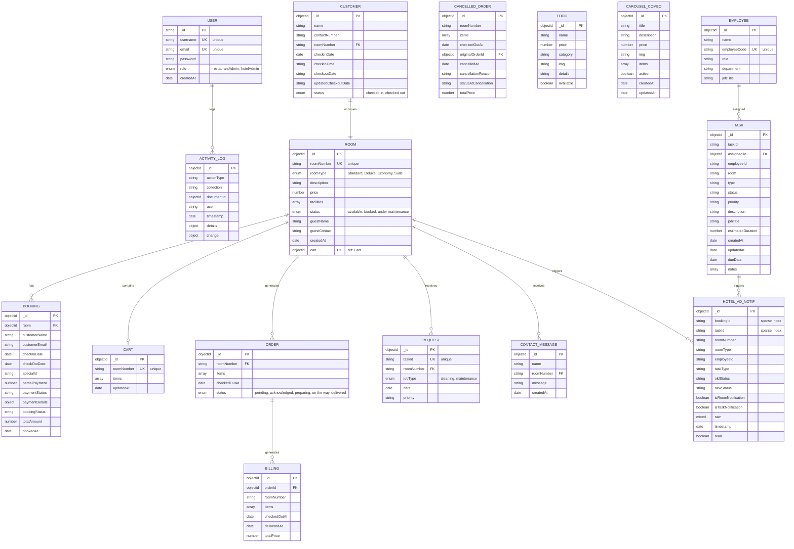

# Entity Relationship Diagram (ERD) - Hotel Management System

## Complete System ERD



## Entity Summary

### Core Entities

#### **User**
- Administrative users (restaurantAdmin, hotelAdmin)
- Manages authentication and authorization
- Logs all activities

#### **Customer**
- Hotel guests checking in/out
- Linked to room numbers
- Tracks stay duration and status

#### **Room**
- Core hotel resource
- Multiple types (Standard, Deluxe, Economy, Suite)
- Status tracking (available, booked, maintenance)
- Associated with bookings, carts, orders, and requests

#### **Booking**
- Room reservations
- Payment tracking
- Check-in/check-out management
- Special identifiers and discount tracking

### Food & Beverage Module

#### **Food**
- Menu items catalog
- Categories for organization
- Pricing and availability

#### **Cart**
- Per-room order staging
- Adds items before checkout
- Tracks item details and combo contents

#### **Order**
- Checked-out carts
- Status workflow (pending → delivered)
- Analytics tracking with combo contents

#### **CancelledOrder**
- Archived cancelled orders
- References original order
- Captures cancellation reason and original status

#### **Billing**
- Final invoice generation
- References orders
- Room-specific billing per order

#### **CarouselCombo**
- Promotional bundle offers
- Combines multiple food items
- Active/inactive status for campaigns

### Staff & Task Management

#### **Employee**
- Staff directory
- Department and role tracking
- Unique employee codes

#### **Task**
- Assignments to employees
- Priority and status tracking
- Room-specific work requests
- Estimated duration for planning

#### **Request**
- Room service requests
- Cleaning and maintenance jobs
- Priority levels

### Logging & Notifications

#### **ActivityLog**
- Audit trail for all changes
- Documents user actions
- Tracks old/new values for updates

#### **HotelAdNotif**
- Notifications for admin dashboard
- Tracks room and task status changes
- Read/unread status

#### **ContactMessage**
- Guest messages to front desk
- Room-based communication
- Timestamp tracking

## Key Relationships

1. **Room** is the central hub:
   - Has multiple **Bookings**
   - Contains a **Cart** for current room's orders
   - Generates **Orders** from cart checkouts
   - Receives **Requests** for services
   - Triggers **Notifications**

2. **Order** workflow:
   - Created from **Cart** checkout
   - Generates **Billing**
   - Can be **Cancelled** (archived in CancelledOrder)
   - Status progression tracked

3. **Employee** management:
   - Assigned **Tasks**
   - Tasks trigger **Notifications**

4. **Audit & Compliance**:
   - **User** actions logged to **ActivityLog**
   - System changes tracked via **HotelAdNotif**

## Data Flow

```
Guest Interaction:
Booking (reservation) → Check-in (Customer) → Room Assignment
                              ↓
                          Cart (add items)
                              ↓
                          Order (checkout)
                              ↓
                          Billing (invoice)

Room Service:
Request (cleaning/maintenance) → Task Assignment → Employee Action
                                        ↓
                                  Notification

Administrative:
User Login → Activity Logging → Audit Trail
```
